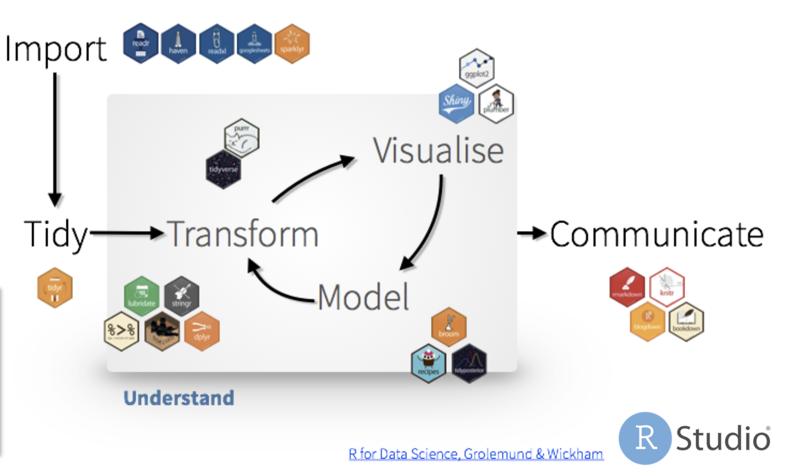
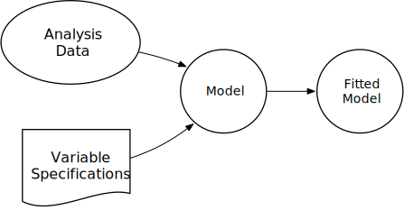
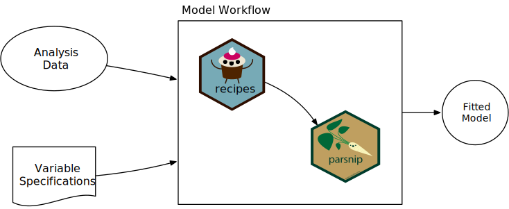

# Applied tidymodeling

---

## Modeling in the Tidyverse

What we will cover:

* A brief introduction to tidymodeling
* Productionalizing models with plumber
* Deploying and hosting with connect
---

The end products: 
* https://colorado.rstudio.com/rsc/genre-pred/
* https://colorado.rstudio.com/rsc/hiphop-or-country/

---

# What is tidymodels?

```{r}
library(tidymodels)
```

Plus `tidypredict`, `tidyposterior`, `tidytext`, `butcher`, and more in development.

---

# tidyverse paradigmn

* ` %>% ` the pipe

```{r}
mean(1:10)

1:10 %>% 
  mean()
```
---

# The Pipe `%>%`

 
```{r, eval = FALSE}
data %>% 
  do_something(.) %>% 
  do_another_thing(.) %>% 
  do_last_thing(.)
```

--

`do_something(data)` is equivalent to:  

--

* `data %>% do_something(data = .)`  

--

* `data %>% do_something(.)`  

--

* `data %>% do_something()`  


---

# Analysis Workflow


---

# Tidyverse Worflow



---

# Modeling Worflow



---

# Tidymodels workflow



---

##  Motivation: Predicting Class Probabilities

| Function | Package | Code |
| -------- | -------| ------| 
| `lda` | `MASS` | `predict(obj)` |
| `glm` | `stats` | `predict(obj, type = "response")` |
| `rpart` | `rpart` | `predict(obj, type = "prob")` |
| `logitboost` | `LogitBoost` | `predict(obj, type = "raw", nIter)` |

---

# `parsnip`


---
# `parsnip`

---

# `parsnip`

* General interface for modeling

--

* specifications:

--

  * model
  
--

  * engine

--

  * fit
  
--

* [models](https://tidymodels.github.io/parsnip/reference/index.html)


---

## Example

```{r}
# model
decision_tree(mode =  "classification") %>% 
  # engine
  set_engine("rpart") %>% 
  # fit 
  fit(Species ~ ., data = iris)
```

---

## Changing engines

```{r}
# model
iris_fit <- decision_tree(mode =  "classification") %>% 
  # engine
  set_engine("C5.0") %>% 
  # fit 
  fit(Species ~ ., data = iris)

iris_fit
```

---

##  `recipes`


---

# `recipes`

* preprocessing interface

--

* dplyr-like syntax

--

* tidyselect-like syntax

---

## Defining our `recipe()`

* Our recipe is the plan of action
* We can add `step_*()`s to our recipe

```{r}
iris_rec <- recipe(Species ~ ., data = iris)

iris_rec
```
---

# preprocessing steps

* pre-processing steps are specified with the `step_*()` functions

--

* Some of which are:

--

  - `step_center()`
  
--

  - `step_scale()`
  
--

  - `step_log()`
  
--

* Check reference [documentation](https://tidymodels.github.io/recipes/reference/index.html)

---

# preprocessing steps

* `dplyr`-like syntax:
  * `all_predictors()`
  * `all_outcomes()`
  * `has_type()`
  * `all_numeric()`
  * `all_nominal()`
  
---

## Example:

```{r}
iris_steps <- iris_rec %>% 
  step_center(all_numeric()) %>% 
  step_scale(all_predictors())

iris_steps
```

---


## Prepping our `recipe`

* We `prep()` our recipe when we are done specifying the preprocessing steps
* This prepped recipe can be used to preprocess new data

---

## Prepping our `recipe`

```{r}
prepped <- prep(iris_steps)

prepped
```


---

## Preprocessing new data

* We `bake()` our recipe and our ingredients (new data)
* syntax: `bake(prepped_recipe, new_data)`

```{r}
bake(prepped, head(iris))
```

---

## Partitioning - `rsample`


---


## `rsample`
* We want to follow the train and test split
* three key functions:
  * `initial_split(data, prop, strata)`
    * strata - used for stratified sampling 
  * `training()`
  * `testing()`

---

## `rsample`

```{r}
init_split <- initial_time_split(iris, prop = 2/3, strata = Sepcies)

init_split
```

---

## `rsample`

```{r}
training(init_split) %>% 
  slice(1:10)
```

---

## `rsample`

```{r}
testing(init_split) %>% 
  slice(1:10)
```

---

# Model Evalutation: `yardstick`


---

## `yardstick`

* A package for evaluating models

* Predictions are returned in a `tibble`

* General interface permits easy comparisons


---

## prediction

* `type = "class"`

```{r}
predict(iris_fit, iris[1:5,], type = "class")
```

---

## prediction

* `type = "prob"`

```{r}
predict(iris_fit, iris[1:5,], type = "prob")
```

---

## other prediction types:

--

* `conf_int`

--

* `pred_int`

--

* `quantile`

--

* `numeric`

--

* `raw`

---

## model `metrics()`

* `metrics()`: provides common performance estimates 

* `metric_set()`: used to define custom model metrics

---

## Metrics example

```{r}
preds <- predict(iris_fit, iris[1:5,]) %>% 
  bind_cols(iris[1:5,]) 
  
metrics(preds, Species, .pred_class)
```

---

## Our own metric set


```{r}
pref_metrics <- metric_set(accuracy, spec, sens, f_meas)

pref_metrics(two_class_example, truth = truth, estimate = predicted)
```

---

class: center, middle, inverse

# Putting it together

### Code walk through

---

class: center, middle, inverse

# very brief intro to Plumber

---

# Plumber

* Create REST API 

* simple code "decorations" (roxygen-like)

---

## Structure `plumber.R`

* supports: 
  * `@get`
  * `@post`
  * `@put`
  * `@delete`
  * `@head`

```
#* @apiTitle engaging title


#* description of endpoint's utility
#* @param param_name useful param description 
#* @get /param_endpoint
```

---

## Endpoint Example

```
#* Retrieve lyrics for a single song
#* @param artist name of the artist
#* @param song the name of the song / track
#* @get /track
function(artist, song) {
  genius::genius_lyrics(artist, song)
}
```


---

## Launch the API

```
pr <- plumb("plumber.R")
pr$run()
```

---